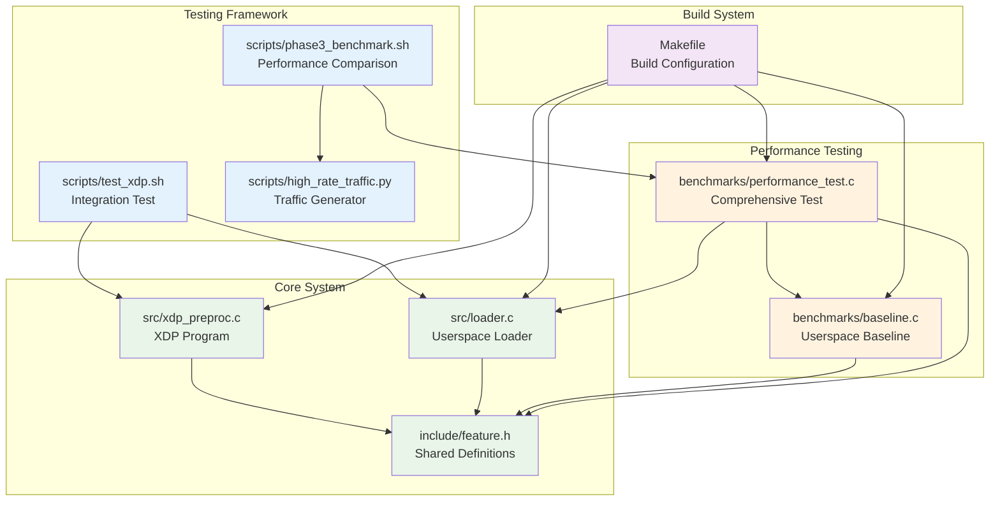
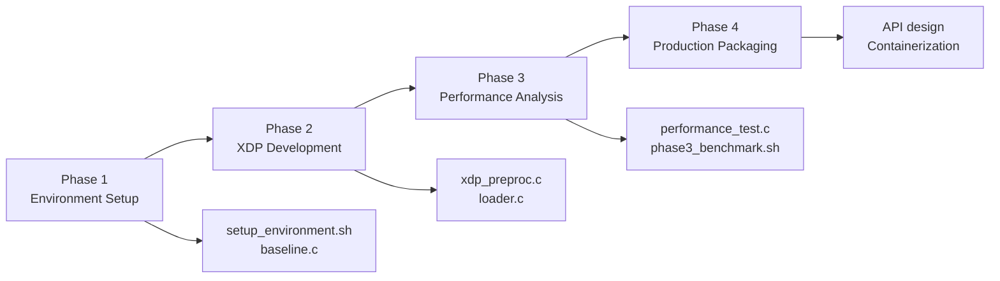
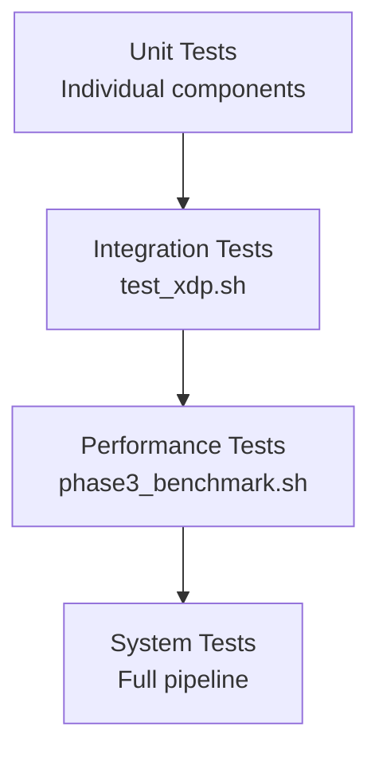

# eBPF-Test Code Structure Guide

**Detailed breakdown of project organization and file relationships**

## 📁 Project Structure

```
eBPF-Test/
├── README.md                   # Main project overview
├── GETTING_STARTED.md          # Quick setup guide
├── ARCHITECTURE.md             # System design with diagrams
├── Makefile                    # Build system
├── .changelog                  # Version history
├── .dependencies               # System requirements
├── .code_structure             # Architecture mapping
├── .context                    # Business domain info
├── 
├── src/                        # Core implementation
│   ├── xdp_preproc.c          # XDP kernel program
│   └── loader.c               # Userspace loader
├── 
├── include/                    # Shared headers
│   └── feature.h              # Feature structure definitions
├── 
├── benchmarks/                 # Performance testing
│   ├── baseline.c             # Userspace baseline
│   └── performance_test.c     # Comprehensive testing
├── 
├── scripts/                    # Testing and automation
│   ├── test_xdp.sh            # XDP integration test
│   ├── phase3_benchmark.sh    # Performance comparison
│   ├── high_rate_traffic.py   # Traffic generator
│   ├── generate_udp_traffic.py # Simple traffic generator
│   ├── setup_environment.sh   # Automated setup
│   └── verify_setup.sh        # System verification
├── 
├── docs/                       # Organized documentation
│   ├── README.md              # Documentation index
│   ├── phase1/                # Phase 1 documentation
│   ├── phase2/                # Phase 2 documentation
│   ├── phase3/                # Phase 3 documentation
│   └── development/           # Development guides
├── 
├── build/                      # Generated binaries
│   ├── xdp_preproc.o          # Compiled XDP program
│   ├── xdp_loader             # Userspace loader
│   ├── baseline_app           # Baseline processor
│   └── performance_test       # Performance test tool
├── 
└── results/                    # Test results and logs
    └── phase3_*/              # Timestamped test results
```

## 🧩 Component Relationships



## 📋 File Descriptions

### Core Implementation

#### `src/xdp_preproc.c`
**Purpose**: XDP kernel program for packet processing
**Key Functions**:
- `xdp_packet_processor()`: Main XDP program entry point
- `parse_ethernet()`: Ethernet header parsing
- `parse_ipv4()`: IPv4 header parsing
- `parse_udp()`: UDP header parsing
- `update_stat()`: Statistics management

**BPF Maps**:
- `feature_rb`: Ring buffer for kernel→userspace communication
- `stats_map`: Performance counters

**Size**: 1704B source → 928B JIT compiled

#### `src/loader.c`
**Purpose**: Userspace XDP program management
**Key Functions**:
- `load_xdp_program()`: Load and attach XDP program
- `setup_ring_buffer()`: Initialize ring buffer polling
- `handle_feature()`: Process extracted features
- `cleanup()`: Proper resource cleanup

**Dependencies**: libbpf, libelf

#### `include/feature.h`
**Purpose**: Shared data structures and utilities
**Contents**:
- `feature_t`: 20-byte feature structure
- `perf_stats_t`: Performance statistics structure
- `get_time_ns()`: High-precision timing
- `ip_to_str()`: IP address formatting

### Performance Testing

#### `benchmarks/baseline.c`
**Purpose**: Userspace baseline using AF_PACKET sockets
**Performance**: 127 pps, 0.4 µs latency
**Features**:
- Raw socket packet capture
- Ethernet/IPv4/UDP parsing
- Feature extraction
- Performance statistics

#### `benchmarks/performance_test.c`
**Purpose**: Comprehensive performance testing framework
**Modes**:
- Baseline mode: Direct userspace processing
- XDP mode: Integrated with XDP loader
**Features**:
- Fair comparison testing
- CPU usage monitoring
- Memory usage tracking
- Configurable test parameters

### Testing Framework

#### `scripts/test_xdp.sh`
**Purpose**: XDP integration testing
**Process**:
1. Builds XDP program
2. Starts traffic generator
3. Runs XDP loader
4. Validates packet processing
5. Cleans up resources

#### `scripts/phase3_benchmark.sh`
**Purpose**: Comprehensive performance comparison
**Process**:
1. Builds all components
2. Runs baseline test
3. Runs XDP test
4. Generates comparison report
5. Saves results with timestamps

#### `scripts/high_rate_traffic.py`
**Purpose**: High-performance UDP traffic generation
**Features**:
- Multi-threaded packet generation
- Configurable packet rates
- Multiple UDP flows
- Performance monitoring
- Preset configurations

### Build System

#### `Makefile`
**Targets**:
- `all`: Build all components
- `verify`: Test BPF program loading
- `check-caps`: Verify system capabilities
- `test-performance-*`: Run performance tests
- `clean`: Clean build artifacts

**Features**:
- CO-RE compilation support
- BPF verification
- Dependency management
- Automated testing

## 🔄 Development Workflow

### Phase-Based Development


### Testing Hierarchy


## 🎯 Key Design Patterns

### Error Handling
- **XDP Program**: Return codes (XDP_PASS, XDP_DROP)
- **Userspace**: Proper cleanup with signal handling
- **Testing**: Comprehensive error checking and reporting

### Memory Management
- **Ring Buffer**: Kernel-managed circular buffer
- **Userspace**: Stack-based allocations for performance
- **Cleanup**: Explicit resource deallocation

### Performance Optimization
- **Inline Functions**: Minimize function call overhead
- **Bounds Checking**: Explicit packet boundary validation
- **Statistics**: Efficient counter updates

### Documentation
- **Phase-based**: Documentation organized by development phase
- **Audience-specific**: Different views for different users
- **Comprehensive**: Both high-level and detailed documentation

## 📊 Build Dependencies

### System Requirements
```bash
# Ubuntu packages
clang llvm libbpf-dev linux-headers-$(uname -r)
build-essential bpftool python3

# Kernel requirements
kernel >= 5.10 with BPF support
```

### Build Order
1. **XDP Program**: `src/xdp_preproc.c` → `build/xdp_preproc.o`
2. **Userspace Loader**: `src/loader.c` → `build/xdp_loader`
3. **Baseline**: `benchmarks/baseline.c` → `build/baseline_app`
4. **Performance Test**: `benchmarks/performance_test.c` → `build/performance_test`

### Testing Dependencies
- **XDP Program**: Depends on successful BPF compilation
- **Integration Tests**: Depend on all binaries being built
- **Performance Tests**: Depend on traffic generation capabilities

## 🔧 Development Guidelines

### Code Style
- **C Code**: Linux kernel style for XDP programs
- **Userspace**: Standard C with error checking
- **Shell Scripts**: Bash with proper error handling
- **Python**: PEP 8 compliance

### Documentation
- **Every file**: Header comment with purpose
- **Functions**: Inline documentation for complex logic
- **Performance**: Document performance implications
- **Testing**: Document expected behavior and results

### Testing
- **Unit Tests**: Test individual components
- **Integration Tests**: Test component interactions
- **Performance Tests**: Measure and validate performance
- **System Tests**: End-to-end validation

---

This structure enables efficient development, testing, and maintenance of the eBPF-Test system while providing clear separation of concerns and comprehensive documentation. 